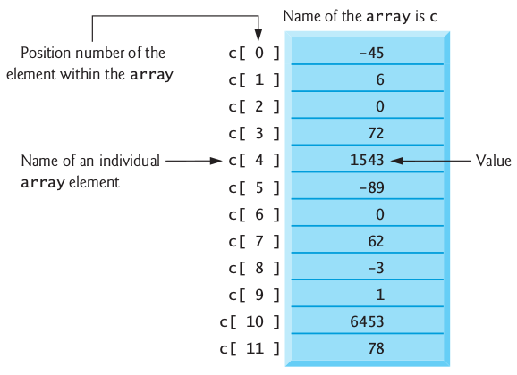

# Arrays & Vectors

Two new data structures - collections of related data items.
- **arrays** which are fixed-size collections consisting of data items of the same type, and
- **vectors** which are collections (also of data items of the same type) that can grow and shrink dynamically at execution time.

Both array and vector are C++ standard library class templates.

## Arrays

An **array** is a **contiguous group** of memory locations that all have the **same type**.

To refer to a particular location or element in the array, *specify* the **name** of the array and the **position number** of the particular element.
- The position number is more formally called a **subscript** or **index** (this number specifies the number of elements from the beginning of the array).
- A subscript must be an integer or integer expression (using any integral type).



- The first element in every array has subscript 0 (zero) and is sometimes called the zeroth element.
- The highest subscript in array c is 11, which is 1 less than the number of elements in the array (12).

### Declaring Arrays

Arrays occupy space in memory.
- arrays can be declared to contain values of most data types.

To specify the type of the elements and the number of elements required by an array use a declaration of the form:

        array< type, arraySize > arrayName;

The notation `<type, arraySize>` indicates that array is a class template.
- The compiler reserves the appropriate amount of memory based on the type of the elements and the arraySize.
- This is C++11 style declaration, and it requires to include `<array>` header file.

```c++
// Initializing an array in a declaration.
#include <iostream>
#include <iomanip>
#include <array>
using namespace std;

int main() {
   array<int, 5> n{32, 27, 64, 18, 95}; // list initializer

   cout << "Element" << setw(10) << "Value" << endl;

   // output each array element's value
   for (size_t i{0}; i < n.size(); ++i) {
      cout << setw(7) << i << setw(10) << n[i] << endl;
   }
}
```

The elements of an array also can be initialized in the array declaration by following the array name with an equals sign and a brace-delimited comma-separated list of **initializers**.
- If there are **fewer** initializers than elements in the array, the remaining array elements are initialized to zero.

There is also old *C-style* array declaration:

        type arrayName[arraySize];

The following examples demonstrate how to declare arrays, how to initialize arrays and how to perform common array manipulations.

```c++
// Initializing an array ’s elements to zeros and printing the array .
#include <iostream>
#include <iomanip>
using namespace std;

int main() {
   int n[5]; // n is an array of 5 int values

   // initialize elements of array n to 0
   for (int i{0}; i < 5; ++i) {
      n[i] = 0; // set element at location i to 0
   }

   cout << "Element" << setw(10) << "Value" << endl;

   // output each array element's value
   for (int j{0}; j < 5; ++j) {
      cout << setw(7) << j << setw(10) << n[j] << endl;
   }
}
```

A constant variable can be used to specify array's size.
- Use `const` modifier.
- It must be initialized with a constant expression when it's declared and cannot be modified thereafter.
- Constant variables are also called named constants or read-only variables.
- Not initializing a constant variable when it’s declared is a compilation error.
- Assigning a value to a constant variable in a separate statement from its declaration is a compilation error.

```c++
// Set array s to the even integers from 2 to 10.
#include <iostream>
#include <iomanip>
#include <array>
using namespace std;

int main() {
   // constant variable can be used to specify array size
   const size_t arraySize{5}; // must initialize in declaration

   array<int, arraySize> values; // array values has 5 elements

   for (size_t i{0}; i < values.size(); ++i) { // set the values
      values[i] = 2 + 2 * i;
   }

   cout << "Element" << setw(10) << "Value" << endl;

   // output contents of array s in tabular format
   for (size_t j{0}; j < values.size(); ++j) {
      cout << setw(7) << j << setw(10) << values[j] << endl;
   }
}
```

Often, the elements of an array represent a series of values to be used in a calculation.

```c++
// Compute the sum of the elements of an array.
#include <iostream>
#include <array>
using namespace std;

int main() {
   const size_t arraySize{4}; // specifies size of array
   array<int, arraySize> a{10, 20, 30, 40};
   int total{0};

   // sum contents of array a
   for (size_t i{0}; i < a.size(); ++i) {
      total += a[i];
   }

   cout << "Total of array elements: " << total << endl;
}
```

Use array to draw a histogram:

```c++
#include <iostream>
#include <iomanip>
#include <array>
using namespace std;

int main() {
   const size_t arraySize{11};
   array<unsigned int, arraySize> n{0, 0, 0, 0, 0, 0, 1, 2, 4, 2, 1};

   cout << "Grade distribution:" << endl;

   // for each element of array n, output a bar of the chart
   for (size_t i{0}; i < n.size(); ++i) {
      // output bar labels ("0-9:", ..., "90-99:", "100:")
      if (0 == i) {
         cout << "  0-9: ";
      }
      else if (10 == i) {
         cout << "  100: ";
      }
      else {
         cout << i * 10 << "-" << (i * 10) + 9 << ": ";
      }

      // print bar of asterisks
      for (unsigned int stars{0}; stars < n[i]; ++stars) {
         cout << '*';
      }

      cout << endl; // start a new line of output
   }
}
```